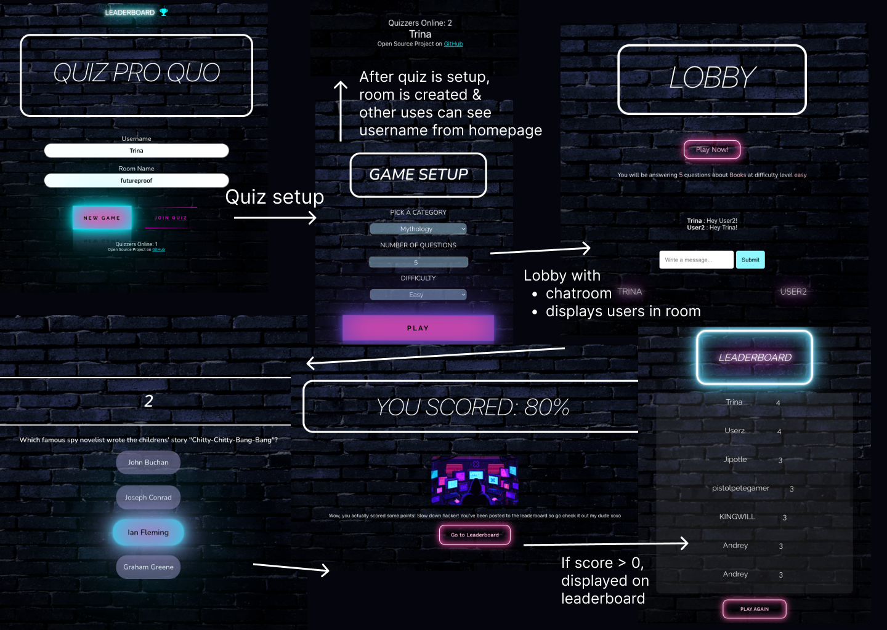

# QuizProQuo
 Lap 3 quiz website built with React, MongoDB, Express and Node.js
 Project team consists of:
 * [Andrew](https://github.com/akennedy205) - API and Database
 * [Diren](https://github.com/Dnayir) - Sockets and logic
 * [Yusra](https://github.com/yusra-tahir) - Front end design
 * [Trina](https://github.com/trinayau) - Sockets and logic, front end design

## Project Description
This is a Lap 3 futureproof group project to make a quiz website using MERN stack, socket.io and OpenTriviaDB API.
Quiz-Pro-Quo is MERN fullstack application.
[Check out our presentation here!](https://docs.google.com/presentation/d/1VIfxZGBgPGmab93PZb7CP9ZojwH718spbEjiYoBl_OU/edit?usp=sharing)

## Installation and Usage
### Installation & Usage
 * Clone this repo and navigate to root directory
 * `cd` into frontend file and in terminal, `npm install`
#### Client-side
 * For client, `cd frontend` and `npm run start`, it should automatically load on `http://localhost:3000`

#### Server-side
 * For server, `cd server`, `npm install` and `npm run dev`  
 To use docker:  
 To start server with docker open terminal, make sure you are in root folder and run `bash _scripts/startDev.sh`
 * Starts API and DB services
 * Serves API on `http://localhost:3001`  
 * It is not possible to fully run our API and DB locally due to hidden process.env variables, feel free to substitute the Mongo URI in with your own in `server/db/mongoInit.js`!
 * You can check out our Heroku deployment [here](https://quizpq.herokuapp.com/) 

 * To teardown docker compose completely:  
    `bash _scripts/teardown.sh` 
    
#### Websocket Server
 To set up socket server:  
* `cd socketio`  
* `npm install`
* `npm run dev`
* We separated our socket server out to prevent merge conflicts between Trina + Diren working on websockets and Andrew working on the database
* It is fully possible to integrate this into the API server to prevent having to deploy our servers separately on Heroku, which we did this time due to time constraints and also to improve Heroku deployment knowledge

## Technologies:
- Socket.io
- MongoDB, Express.js, React, Node
- OpenTriviaDB API

### Dependencies:
 - Server: cors, socket.io, express, MongoDb, Mongo Atlas, Nodemon, Axios, Docker, Redux

 - Fontawesome, Redux-dev-tools, Redux-thunk

### DevDependencies: 
- Jest, Supertest
- React testing library

## Planning and Delivery
### Planning
* Looked at other quiz games to get ideas for our project and to identify features that we liked
* Planned out user journey map on Figma as a group
* Discussed aesthetic we wanted- a grungy, neon vibe that appeals to many users
* Laid out the requirements of our MVP:
>> Create a responsive, multiplayer quiz React website with chat room in the lobby and a leaderboard linked to our API which posts to a MongoDB database
* Discussed must-haves, should-haves and could-haves and won't haves using MoSCoW prioritisation method
* Agreed on our way of working: twice-daily standups to discuss management of project, blockers and daily goals
* Pair programming between different members to implement Redux, Sockets and other logic to prevent clashes and promote collaborative working

### Delivery
* Deployed client on Netlify
* API which writes to MongoDB Atlas was deployed on Heroku
* Socket server also deployed separately on Heroku
 
## Wins & Challenges

### Wins
- Successful deployment to Netlify and Heroku, using .env variables for the first time
- App is responsive and works in both mobile and desktop
- Multiplayer waiting lobby and chat-room functioning across multiple devices
 -Successful implementation of websockets and Redux
### Challenges
- Understanding and implementation of sockets
- Duplicated submissions to leaderboard, which was fixed by removing React.StrictMode
- Testing React, especially mocking user events and fetches

## Future Features
 - Sound effects
 - Question countdown timer (can be easily implemented through React-Bootstrap and using setIntervals)
 - Random punishment generation for the losers (randomly generated array, can be stored either in Redux or fetched from server DB)
 - Displaying scores for all players in the room at the end of the game (through sockets)
 - Displaying rooms available to be joined (to be implemented in socket server and sending information to client)

## Final Look

Check out the deployed version here and play with your friends: https://quiz-pro-quo.netlify.app/
